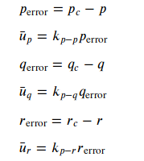
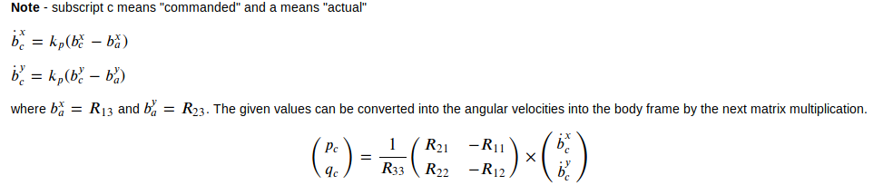
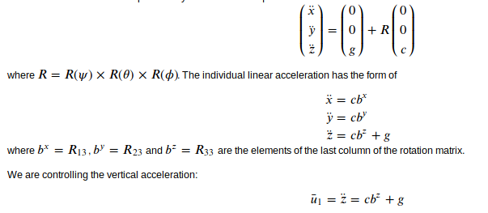
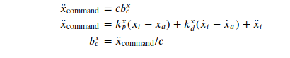

#  C++ Controls Project Solution Description #

In the page we explain the solution for the C++ controls project, part of the Flying Car and Autonomous Flight Nanodegree program.

The following sections explain the implementation details of each of the controllers :

 - [Body Rate Controller](#body-rate-controller)
 - [Roll Pitch Controller](#roll-pitch-controller)
 - [Altitude Controller](#altitude-controller)
 - [Lateral Position Controller](#lateral-position-controller)
 - [Yaw Controller](#yaw-controller)
 - [Motor Thrusts Calculation](#motor-thrusts-calculation)
 - [Scenario Evaluations](#evaluation)

## Body Rate Controller ##

The body rate controller is a P Controller that collects the commanded roll, pitch, and yaw are translated into the desired rotational accelerations along X,Y and Z axis in the body frame.
We make use of the below formulas from the exercises.



The below code is implemented in the [BodyRateControl method](./src/QuadControl.cpp#L89-L115)
Note that kpPQR is the same as kp-p, kq-q and kr-r from the above formula.
```
  ////////////////////////////// BEGIN STUDENT CODE ///////////////////////////
  // Get the error
  V3F pqrError = pqrCmd - pqr;
  // Multiple by the corresponding kp gains
  V3F ubarPQR = kpPQR * pqrError;
  V3F I_XYZ = V3F(Ixx, Iyy, Izz);
  // Set the moments
  momentCmd = ubarPQR * I_XYZ;
  /////////////////////////////// END STUDENT CODE ////////////////////////////
```


## Roll Pitch Controller ##

The roll-pitch controller is a P controller responsible for commanding the roll and pitch rates (𝑝𝑐 and 𝑞𝑐) in the body frame. First, it sets the desired rate of change of the given matrix elements using a P controller.



The below code was implemented in the [RollPitchControl method](./src/QuadControl.cpp#L118-L163)

```
  ////////////////////////////// BEGIN STUDENT CODE ///////////////////////////
  if (collThrustCmd > 0.0) {
    float accelXActual = R(0,2);
    float accelYActual = R(1,2);
    float accelZ = - collThrustCmd / mass;

    float accelXCommanded = CONSTRAIN(accelCmd.x / accelZ, -maxTiltAngle, maxTiltAngle);
    float accelYCommanded = CONSTRAIN(accelCmd.y / accelZ, -maxTiltAngle, maxTiltAngle);

    float accelXDot = kpBank * (accelXCommanded - accelXActual);
    float accelYDot = kpBank * (accelYCommanded - accelYActual);

    pqrCmd.x = (R(1,0) * accelXDot - R(0,0) * accelYDot) / R(2,2);
    pqrCmd.y = (R(1,1) * accelXDot - R(0,1) * accelYDot) / R(2,2);
  } else {
    pqrCmd.x = 0.0;
    pqrCmd.y = 0.0;
  }

  pqrCmd.z = 0.0;

  /////////////////////////////// END STUDENT CODE ////////////////////////////
```

## Altitude Controller ##

The Altitude Controller is a PID Controller that outputs the total collective thrust command of the drone.
We first calculate the linear acceleartion in the z direction using the below linear equation,



Once, we have the acceleration in the z direction, we use `F = ma` to calculate the thrust.

The code below is implemented in the [AltitudeControl method](./src/QuadControl.cpp#L165-L205).

```
  ////////////////////////////// BEGIN STUDENT CODE ///////////////////////////
  float posZError = posZCmd - posZ;
  float velZError = velZCmd - velZ;

  integratedAltitudeError += velZError * dt;

  // PID Controller
  float u1Bar =  kpPosZ * posZError + KiPosZ * integratedAltitudeError + kpVelZ * velZError + accelZCmd;
  // PD Controller
  // float u1Bar =  kpPosZ * posZError + kpVelZ * velZError + accelZCmd;
  float acceleration = (u1Bar - CONST_GRAVITY) / R(2,2);

  thrust = - mass * CONSTRAIN(acceleration, -maxDescentRate / dt, maxAscentRate / dt);

  /////////////////////////////// END STUDENT CODE ////////////////////////////
```
## Lateral Position Controller ##

The lateral controller is a PD controller that commands target values for elements of the drone's rotation matrix. 
The drone generates lateral acceleration by changing the body orientation which results in non-zero thrust in the desired direction. This will translate into the commanded rotation matrix elements 𝑏𝑥𝑐 and 𝑏𝑦𝑐. 

The control equations have the following form:



Similarly for the y component, the control equations have the same form.

The [LateralPosition method](./src/QuadControl.cpp:L208-L271) is modified as below,

```
  ////////////////////////////// BEGIN STUDENT CODE ///////////////////////////
  V3F kpPos;
  kpPos.x = kpPosXY;
  kpPos.y = kpPosXY;
  kpPos.z = 0.f;

  V3F kpVel;
  kpVel.x = kpVelXY;
  kpVel.y = kpVelXY;
  kpVel.z = 0.f;

  V3F velConstrainedCmd, velConstrained;
  // Limit velocities
  if (velCmd.mag() > maxSpeedXY) {
    velConstrainedCmd = velCmd.norm() * maxSpeedXY;
  } else {
    velConstrainedCmd = velCmd;
  }

  if (vel.mag() > maxSpeedXY) {
    velConstrained = vel.norm() * maxSpeedXY;
  } else {
    velConstrained = vel;
  }

  accelCmd += kpPos * (posCmd - pos) + kpVel * (velConstrainedCmd - velConstrained);

  // Limit acceleration
  if (accelCmd.mag() > maxAccelXY) {
    accelCmd = accelCmd.norm() * maxAccelXY;
  }

  /////////////////////////////// END STUDENT CODE ////////////////////////////
 ```
 In the above code, notice that we constrain the commanded velocity and the actual velocity to `maxSpeedXY` and the calculated acceleration to `maxAccelXY`.
 
## Yaw Controller ##

Perhaps the most simplest of all the controller, the Yaw Controller is a simple P Controller that controls the drone's Yaw angle.

The [YawControl method](./src/QuadControl.cpp#L274-L294) is implemented as follows,

```
 ////////////////////////////// BEGIN STUDENT CODE ///////////////////////////
  float yawError = yawCmd - yaw;

  yawRateCmd = kpYaw * yawError;

  /////////////////////////////// END STUDENT CODE ////////////////////////////
```

##  Motor Thrusts Calculation ##

To calculate the motor thrusts for each of the propellers, we are given a collective thrust command and moments around the X, Y and Z axis.

We are given the drone arm distance `L` that is the distance from the center of mass of the drone to the motor.
The perpendicular distance `lPerpendicular` on the X axis is thus `L / sqrt(2)` as the angle inscribed in 45 degrees.

Let F1, F2 , F3 and F4 be the individual motor thrusts. Let tauX, tauY and tauZ be the moments around the X, Y and Z axis.

we then have,

    tauX / lPerpendicular = f1 = (F1 + F4 - F2 - F3)  // Roll
    tauY / lPerpendicular = f2 = (F1 + F2 - F3 - F4)  // Pitch
    tauZ / km = f3 = (F1 - F2 + F3 - F4)  // Yaw
    Ftotal = F1 + F2 + F3 + F4  // Total Thrust

We know the values of the moments, total thrust command, lPerpendicular and km (kappa). Thus we have 4 equations and 4 unknows.

Solving, we have

    F1 = (f1 + f2 + f3 + fTotal) / 4    
    F2 = (-f1 + f2 - f3 + fTotal) / 4   
    F3 = (f1 - f2 - f3 + fTotal) / 4    
    F4 = (-f1 - f2 + f3 + fTotal) / 4   

The [GenerateMotorCommands method](./src/QuadControl.cpp#L-57-L87) implements the above equations,

```
////////////////////////////// BEGIN STUDENT CODE ///////////////////////////
  float lPerpendicular = L / sqrtf(2.f);
  float f1 = momentCmd.x / lPerpendicular;
  float f2 = momentCmd.y / lPerpendicular;
  float f3 = - momentCmd.z / kappa; // Thrust is negative in the upward direction
  float fTotal = collThrustCmd;

  cmd.desiredThrustsN[0] = (f1 + f2 + f3 + fTotal)/4.f;  // front left
  cmd.desiredThrustsN[1] = (-f1 + f2 - f3 + fTotal)/4.f; // front right
  cmd.desiredThrustsN[2] = (f1 - f2 - f3 + fTotal)/4.f ; // rear left
  cmd.desiredThrustsN[3] = (-f1 - f2 + f3 + fTotal)/4.f; // rear right

  /////////////////////////////// END STUDENT CODE ////////////////////////////
```
## Scenatio Evaluations ##

### Scenario 1

The mass should be adjusted so as to avoid the Quad from falling down.

The [QuadControlParams.txt](./config/QuadControlParams.txt) contains all the Quad parameters. 

Adjusting the mass to a value of 0.5 ensures the Quad from falling down. 


### Scenario 2 : Body Rate and Roll Pitch Control

We adjust the values of `kpPQR` for the `BodyRateControl` and kpBank for `RollePitchControl`.

On correct tuning, the scenario passes.


### Scenario 3 : Yaw Angle and Lateral Position Control

The values of `kpYaw, kpPosZ, kpVelZ, kpPosXY, kpVelXY` are tuned in order to ensure that both the drones are corrected aligned.


### Scenario 4 : Non Idealities and robustness

An integral is also added in the `AltitudeControl` so as to take into account the mass errors.

On tuning the integral control and subsequently other parameters too, the 3 Quads follow the target trajectories.


### Scenario 5 : Tracking Trajectories

We fine tune all the parameters once agian to ensure that the Yellow Quad closely follows the trajectory of Eight.

The heavier Red Quad is however not following the trajectory as the Yellow one.


### Note on parameters tuning

The tuning of the parameters is the most important aspect of this project and one spends considerable time to fine tune them.
Patience is the key here and eventually all 5 scenarios should pass with the same set of fine tuned parameters.